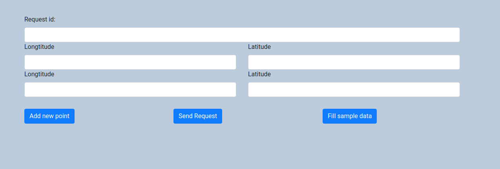

### GETTING STARTED

1. To run this application you need to have installed docker and docker-compose, 
if you don't have it already, please visit this sites for further instruction:  
    - [docker](https://docs.docker.com/ee/supported-platforms/)  
    - [docker-compose](https://github.com/Yelp/docker-compose/blob/master/docs/install.md)  
2. If you have docker applications installed type this commands to build docker container:  
`make build`  
`make dev`
4. If you want to create superuser:  
`make createsuperuser`

### USAGE

When project will be up go to: `http://localhost:8000/main/`
Then you should see 


#### Frontend features
- `Add new point` Adds new row with blank inputs of longitude and latitude
- `Send request` Sends `POST` request to `http://localhost:8000/total-distance/`
- `Fill sample data` Fills inputs with sample data for you


### API
endpoint adddress: `http://localhost:8000/total-distance/`

- Accepted method: `POST`
- CSRF validation is disabled
- Valid request body: 
```ts
{requestId: "sampleID1615186150081", coordinates: [["-23", "-79"], ["28", "-148"]]}
```
- response body
```ts
{"distance": 270401999.6, "processing_time": 2.69}
```
- error response with 400 status code
```ts
{"error": "Some error message"}
```
